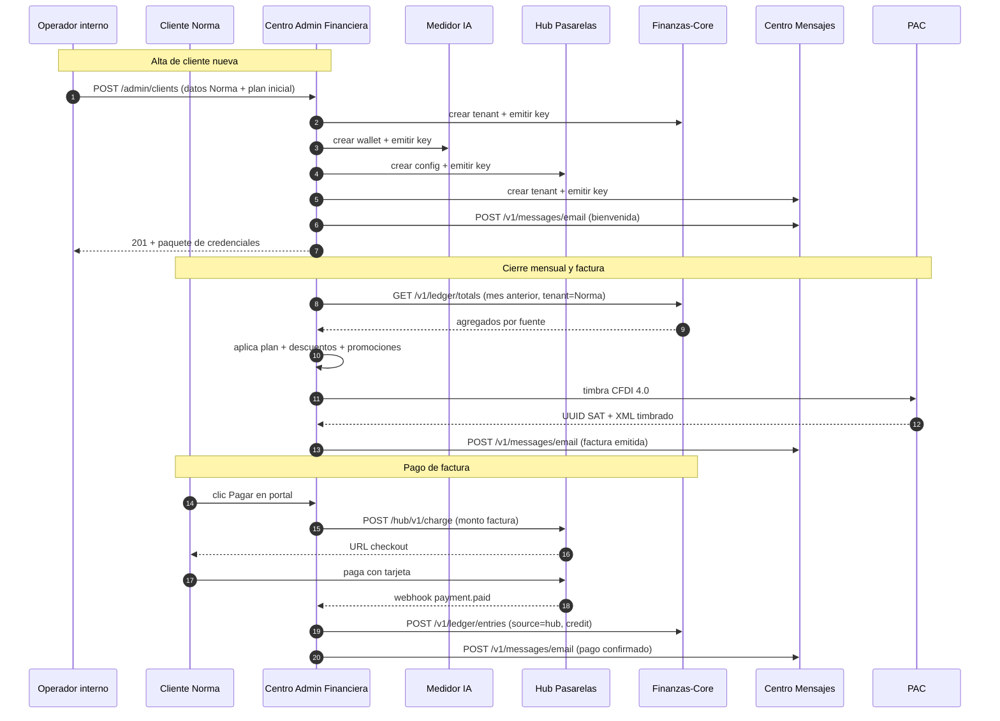

# Centro de Administración Financiera (CAF)

**Módulo Nivel 2 que convierte la infraestructura de los cuatro cores Nivel 1 en un producto comercial completo: incorporación automática de clientes, catálogos de planes y precios, cobranza con factura fiscal, portal del cliente y tableros directivos.**

Documento técnico de proyecto · Inovaweb Soluciones Tecnológicas de México S.A. de C.V. · Versión 0.1.0 · Mayo 2026

---

## Resumen ejecutivo

El Centro de Administración Financiera, abreviado en lo sucesivo como CAF, es la pieza Nivel 2 que cierra la plataforma Inovaweb. Su rol es convertir la infraestructura técnica ya operativa de los cuatro cores Nivel 1 —Medidor IA, Hub de Pasarelas, Centro de Mensajes y Finanzas-Core— en un producto comercial vendible, escalable y auditable. Hasta su construcción, dar de alta a un cliente nuevo requiere intervención manual de personal técnico sobre cuatro bases de datos distintas, los precios viven cableados en código, no se pueden aplicar descuentos ni promociones por temporada, no se puede emitir factura electrónica fiscal mexicana, no existe portal donde el cliente vea su consumo ni recargue saldo, y no hay tablero consolidado de ingresos para dirección.

El CAF expone dos vistas funcionalmente equivalentes pero filtradas estrictamente por rol: una vista interna bajo `admin.inovaweb.com.mx` para el equipo operativo de Inovaweb, con visibilidad total y capacidad de configuración, y una vista cliente bajo `app.inovaweb.com.mx` donde cada cliente externo ve únicamente su propia información. Ambas comparten el mismo backend FastAPI; el routing por dominio lo resuelve el propio servicio en base al header Host, replicando un patrón estándar de plataformas SaaS multi-rol.

Es el módulo de mayor alcance del ecosistema, equivalente al doble del esfuerzo del Centro de Mensajes ya entregado en mayo de 2026, principalmente porque suma dos dimensiones nuevas: interfaz visual web operada por humanos y autenticación por usuario y contraseña con roles granulares y sesiones JWT, en contraposición al modelo API-key-only de los cuatro cores Nivel 1. El proyecto se ejecuta con la misma metodología que validó el Centro de Mensajes —documentación primero, construcción por capas, auditoría obligatoria de cuatro ojos antes de exposición pública, despliegue progresivo— y reutiliza el stack técnico ya conocido por el equipo.

---

## 1. Introducción

A lo largo del primer semestre de 2026, Inovaweb consolidó la construcción de los cuatro cores Nivel 1 de su plataforma. El Medidor IA, operativo desde el cuarto trimestre de 2025, gobierna el consumo de modelos de lenguaje grandes mediante wallets prepagos. El Hub de Pasarelas, en operación desde marzo de 2026, abstrae la integración con Conekta, EVO y otras pasarelas de pago detrás de una sola interfaz. El Finanzas-Core, desplegado en abril de 2026, mantiene el libro contable consolidado e inmutable de todos los movimientos económicos de la plataforma. El Centro de Mensajes, el más reciente, en operación desde mayo de 2026 con auditoría externa nivel bancario aprobada, despacha comunicaciones multicanal por correo, WhatsApp y SMS y reporta sus cargos al ledger.

Esos cuatro cores funcionan, pero carecen de cara visible. Toda interacción con ellos hoy es por interfaz programática autenticada con llaves de aplicación, lo que es adecuado para integración técnica entre sistemas pero inviable para operación comercial. Dar de alta a un cliente nuevo, asignarle un plan, ver cuánto consumió, emitirle una factura, cobrarle, suspenderlo por mora o aplicarle un descuento son operaciones que hoy requieren ejecutar comandos manuales sobre cuatro bases de datos distintas en el servidor de producción. Este modelo escaló a cinco clientes; no escala a cincuenta. La consecuencia operativa es que la plataforma, en su estado actual, no puede crecer comercialmente sin asfixiarse en trabajo manual de personal técnico de alto costo.

El patrón arquitectónico que resuelve este problema es conocido en la industria del software como servicio: una capa Nivel 2 de orquestación y administración que se monta encima de los cores Nivel 1 estables, y que ofrece dos productos visibles claramente diferenciados. Por un lado, un back-office operativo para el equipo financiero de la empresa que opera la plataforma; por el otro, un portal del cliente externo donde cada usuario final accede únicamente a su propia información. Empresas como Stripe, Chargebee, Recurly, Maxio o Paddle ofrecen este modelo en formato SaaS para terceros; el CAF es la implementación interna y soberana de Inovaweb para sus propios clientes, aprovechando que los cores Nivel 1 ya están construidos y blindados.

El CAF tiene un agregado distintivo respecto a soluciones SaaS de terceros: nace integrado con los cuatro cores Nivel 1 de Inovaweb desde el primer día, sin necesidad de mapeo manual de cuentas ni de conciliación periódica entre sistemas. La fuente de verdad contable es siempre el Finanzas-Core; la fuente de verdad de saldos prepagos siempre es el Medidor IA; el cobro siempre pasa por el Hub de Pasarelas; las notificaciones al cliente siempre se envían por el Centro de Mensajes. El CAF no duplica datos: orquesta los cuatro cores y presenta el resultado consolidado en interfaz humana.

---

## 2. Objetivos

### 2.1 Objetivo general

Construir el módulo Nivel 2 de la plataforma Inovaweb que centraliza toda la administración comercial y financiera de los clientes externos, expone dos interfaces filtradas estrictamente por rol —operador interno y cliente externo—, y reemplaza por completo la operación manual sobre bases de datos por una capa de software que registra cada acción con auditoría inmutable, integra los cuatro cores Nivel 1 existentes, y entrega facturación electrónica fiscal mexicana, cobranza automática, promociones configurables y tableros consolidados, operando bajo el mismo modelo de seguridad y despliegue de los cores ya en producción.

### 2.2 Objetivos específicos

- Exponer un endpoint de incorporación atómica de clientes que en una sola transacción cree el registro local en el CAF, dé de alta el tenant correspondiente en los cuatro cores Nivel 1, emita las cuatro API keys de máquina necesarias, asigne el plan inicial elegido y entregue al solicitante un paquete completo de credenciales listo para operar.
- Mantener catálogos administrables de productos comerciales (las apps Nivel 3 que Inovaweb ofrece), servicios cobrables (los conceptos facturables dentro de cada producto), planes (Free, Básico, Profesional, Empresarial) y precios por concepto y por canal, modificables desde la interfaz visual sin necesidad de redespliegue.
- Implementar un sistema completo de promociones que incluya códigos promocionales con vigencia y tope de usos, descuentos por temporada configurables por porcentaje o monto fijo, descuentos por volumen al exceder umbrales, cupones de bienvenida para nuevos clientes y programa de referidos con crédito bidireccional.
- Ejecutar cierre mensual automático que recorra los datos crudos del Finanzas-Core, aplique el plan vigente y las promociones activas del cliente, calcule el monto consolidado, emita el CFDI 4.0 vía PAC certificado, genere los archivos XML y PDF, registre la factura en estado emitida y notifique al cliente vía Centro de Mensajes.
- Operar el seguimiento del ciclo de vida de cada factura: emitida, enviada, pagada total, pagada parcial, vencida, cancelada, en disputa. Disparar recordatorios automáticos cinco días antes del vencimiento, el día del vencimiento y cinco días después por correo y WhatsApp según preferencia del cliente.
- Habilitar al cliente externo a operar de forma autónoma desde el portal: consultar su saldo prepago disponible en el Medidor IA, ver su consumo del periodo desglosado por concepto, descargar sus facturas en archivo fiscal y formato legible, recargar saldo mediante tarjeta vía Hub de Pasarelas y mantener sus datos comerciales actualizados.
- Habilitar al equipo financiero interno a operar el ciclo de vida completo del cliente sin necesidad de intervención técnica sobre bases de datos: alta y baja, cambio de plan, suspensión por mora, aplicación de descuentos puntuales, registro de recargas manuales por canal externo, ajustes con motivo obligatorio y consulta del audit log completo.
- Entregar tableros directivos para Inovaweb con visibilidad sobre el ingreso del periodo, desglose por producto y por cliente, listado de clientes en mora con días vencidos y monto adeudado, conciliación visual del consumo agregado con las facturas de proveedores externos como Resend y DeepSeek, y proyección de ingreso del mes en curso.
- Operar bajo el mismo modelo de seguridad de los cores Nivel 1, con dos agregados específicos: autenticación humana con usuario y contraseña hasheada con Argon2id, segundo factor obligatorio para super-administradores, sesiones JWT con cookies de solo lectura desde el navegador y rotación de refresh tokens.

---

## 3. Planteamiento del problema

### 3.1 Problema a nivel operativo

Al cierre de mayo de 2026, la plataforma Inovaweb tiene cuatro cores Nivel 1 en producción, todos publicados en sus dominios respectivos y todos con auditoría aprobada. Ningún cliente externo puede aún contratar el servicio de manera autoservicio porque no existe la capa comercial que lo permita. Los síntomas operativos concretos son los siguientes.

- **Alta manual de cada cliente.** Incorporar a un cliente nuevo, ejemplificado por el caso real planteado por dirección a fines de mayo de 2026 con la cliente Norma Sánchez para el producto Scraping Web, requiere ejecutar inserciones manuales en cuatro bases de datos distintas alojadas en cuatro contenedores Docker del servidor productivo, emitir cuatro llaves de aplicación con sus respectivos hashes, distribuirlas por canal seguro y configurar los cuatro entornos. El proceso toma entre una y dos horas de personal técnico de alto costo por cada cliente. Insostenible más allá de cinco clientes.
- **Precios cableados en código.** Cada core Nivel 1 conoce hoy los precios de los conceptos que cobra como valores fijos en su archivo de configuración o, peor, en el código fuente del propio servicio. Modificar el precio de un correo desde cincuenta centavos hacia setenta requiere editar el código del Centro de Mensajes y redesplegar el módulo. Crear un plan diferenciado para un cliente específico requiere intervención técnica adicional.
- **Inexistencia de planes y promociones.** No hay forma de aplicar un descuento puntual, una promoción por temporada como Buen Fin o Black Friday, un cupón de bienvenida, un descuento por volumen al exceder un umbral o un programa de referidos. Todo eso vive hoy únicamente en notas dispersas del operador y no se aplica de manera automatizada al consumo.
- **Ausencia de facturación electrónica.** La obligación fiscal mexicana exige factura electrónica CFDI 4.0 para cualquier cobro real a empresa, emitida a través de un Proveedor Autorizado de Certificación. La plataforma actual no tiene esta capacidad. Cualquier cliente que exija factura fiscal queda bloqueado.
- **Ausencia de portal cliente.** Norma Sánchez, o cualquier otro cliente, no tiene hoy ningún lugar donde consultar su saldo, ver su consumo del mes, descargar su factura, recargar saldo de manera autónoma ni gestionar sus datos comerciales. Cada consulta termina como solicitud de atención al equipo interno, costo operativo creciente que escala linealmente con el número de clientes.
- **Ausencia de tablero consolidado.** El equipo directivo no puede saber, a la fecha actual, cuánto factura Inovaweb este mes, cuánto debe cada cliente, cuáles están en mora, cuánto se gastó en proveedores externos como Resend o DeepSeek para conciliar con sus facturas mensuales, ni proyectar el ingreso del mes en curso. La información existe en el Finanzas-Core pero no está agregada en una vista humana navegable.

### 3.2 Problema a nivel de integración

Desde el punto de vista de arquitectura, la situación es la del fanout de cuatro cores Nivel 1 hacia consumidores heterogéneos sin un orquestador intermedio.

- **Acoplamiento N a M.** Hoy, una eventual aplicación de back-office construida para uso interno tendría que conocer e integrarse contra cuatro cores distintos, cada uno con su propia interfaz programática, su propia llave de aplicación y su propia semántica. Multiplicado por la doble vista interna y portal cliente, el acoplamiento se multiplica.
- **Reimplementación del control de acceso en cada consumidor.** Sin una capa Nivel 2 que centralice la autenticación humana, cada futuro consumidor tendría que reimplementar login, gestión de sesiones, recuperación de contraseña, segundo factor, control de roles y filtrado por cliente.
- **Difusión de la lógica comercial entre cores.** Los planes, los descuentos y las promociones son por naturaleza lógica comercial transversal. Si se cablearan en cada core Nivel 1, se viola el principio de responsabilidad única y se convierte cada cambio comercial en un cambio técnico distribuido.
- **Ausencia de punto único para facturación fiscal.** El timbrado CFDI requiere agregar los consumos de los cuatro cores para emitir un único documento fiscal por periodo y por cliente. Sin un orquestador Nivel 2, esta agregación tendría que vivir en cada core que aporta consumo, o en un script externo no auditado.

---

## 4. Descripción del proyecto

### 4.1 Naturaleza del sistema

El CAF es un servicio HTTP construido en Python 3.12 sobre FastAPI con motor uvicorn, persistido en PostgreSQL 16 mediante SQLAlchemy 2 en modo asíncrono y driver psycopg 3. La interfaz visual se sirve desde el propio backend con plantillas Jinja2 e interactividad ligera mediante HTMX y estilos Tailwind CSS compilados sin necesidad de proceso de build con Node. Las llamadas salientes hacia los cuatro cores Nivel 1 y hacia el PAC se realizan con httpx asíncrono. Las credenciales sensibles, incluido el password del certificado de sello digital del SAT, se cifran con AES-256-GCM antes de tocar disco. La autenticación humana usa Argon2id para hashing de contraseñas y JSON Web Tokens firmados con HS256 para sesiones, almacenados en cookies HttpOnly con SameSite estricto. El servicio se empaqueta en imagen Docker multi-etapa basada en `python:3.12-slim`, se orquesta con docker-compose junto a su propia instancia dedicada de PostgreSQL, se expone en el puerto host 8006 del VPS Contabo y se publica al exterior mediante el Caddy compartido del stack n8n. El propio backend distingue por header Host si la petición proviene del dominio operativo o del portal cliente y aplica el routing correspondiente.

### 4.2 Funciones principales

- **Incorporación atómica de clientes (Patrón Saga).** Endpoint POST `/admin/clients` ejecuta una secuencia coordinada de operaciones: inserción local del cliente, alta de tenant en Finanzas-Core con emisión de llave admin, alta de wallet en Medidor IA con emisión de llave, alta de configuración en Hub de Pasarelas con emisión de llave, alta de tenant en Centro de Mensajes con emisión de llave, asignación del plan inicial y registro completo en audit log. Si cualquiera de los pasos falla, se ejecutan las compensaciones inversas y se registra el incidente con todos sus datos.
- **Catálogos comerciales administrables.** Endpoints CRUD para productos (las apps Nivel 3 disponibles para contratación), servicios cobrables por producto, planes con cuota base y límites por concepto, precios unitarios por canal y por plan, métodos de pago habilitados con sincronía contra Hub de Pasarelas, catálogo SAT con regímenes fiscales y usos de CFDI vigentes.
- **Ciclo de vida del cliente.** Operaciones de cambio de plan con transiciones controladas, suspensión por mora con bloqueo automático del consumo en los cores aguas abajo, reactivación tras pago confirmado, baja lógica sin pérdida de historial, edición de datos comerciales con audit log obligatorio.
- **Cierre mensual automático y facturación CFDI 4.0.** Job nocturno del día primero de cada mes que toma los movimientos del periodo anterior desde Finanzas-Core, aplica el plan vigente del cliente con sus descuentos y promociones, calcula el monto consolidado, genera el XML del CFDI, lo timbra contra el PAC contratado, registra el UUID SAT en base, genera el PDF legible, lo dispara como adjunto en correo al cliente vía Centro de Mensajes y actualiza el estado de la factura.
- **Promociones avanzadas.** Códigos promocionales con vigencia desde-hasta y tope de usos globales y por cliente, descuentos por temporada configurables como porcentaje o monto fijo aplicados a planes específicos, descuentos por volumen aplicados al exceder umbrales declarados, cupones de bienvenida automáticos para nuevos clientes, programa de referidos con crédito bidireccional al referido y al referidor.
- **Recargas asistidas y autoservicio.** El operador interno puede registrar recargas manuales cuando el pago llegó por canal externo como transferencia bancaria, dejando audit log y siempre con motivo obligatorio. El cliente externo puede iniciar recargas desde el portal mediante un flujo que delega el cobro al Hub de Pasarelas y, tras confirmación del webhook, acredita el saldo en el Medidor IA, registra el pago local y notifica al cliente.
- **Portal del cliente externo.** Tablero de saldo y consumo del periodo en curso versus límite del plan, historial detallado por día y por concepto, listado de facturas con descarga del archivo fiscal en XML y del archivo legible en PDF, recarga inmediata desde el portal, datos comerciales editables sujetos a aprobación del operador interno, notificaciones recibidas y mensajes con el equipo de soporte.
- **Tableros internos consolidados.** Ingreso del mes, trimestre y año en curso, desglose por producto y por cliente y por concepto y por canal, listado priorizado de clientes en mora con sus días vencidos y monto adeudado, recargas del periodo desglosadas por método de pago para conciliar con estados de cuenta bancarios, consumo agregado por core para conciliar con facturas de proveedores externos, proyección de ingreso del mes en curso basada en patrón histórico.
- **Sistema de auditoría inmutable.** Cada operación de escritura registra en tabla `audit_log` los campos actor (user_id), IP de origen, momento exacto, tipo de entidad afectada, identificador, valor anterior y valor nuevo. La tabla tiene triggers en base de datos que bloquean DELETE y UPDATE de columnas críticas. Consultable desde la vista interna por super-admin.

### 4.3 Convenciones técnicas firmes

- **Montos siempre en centavos enteros BIGINT.** Jamás coma flotante. La conversión a valor humano legible ocurre exclusivamente al presentar.
- **Append-only enforced en operaciones financieras.** Las tablas `invoices`, `payments`, `adjustments` y `audit_log` solo aceptan INSERT. Toda corrección genera nueva entrada inversa con `parent_entry_id` apuntando a la original. La inmutabilidad se enforza mediante triggers PostgreSQL, no solo en código de aplicación.
- **Multi-rol estricto.** Catálogo cerrado de roles: super-admin, finanzas, lectura, client-titular, client-user. Cada endpoint declara su rol mínimo requerido. La autorización se verifica antes de cualquier operación de I/O.
- **Onboarding atómico Patrón Saga.** Las operaciones cross-core son orquestadas por el CAF con compensación inversa en caso de fallo. Cada paso queda registrado en audit log con su estado.
- **Sesiones JWT cortas con refresh largo.** Access token de quince minutos, refresh token de treinta días con rotación obligatoria en cada uso. Cookies HttpOnly con SameSite estricto. Revocación efectiva mediante tabla de tokens revocados consultada en cada validación.
- **CFDI inmutable.** Una vez timbrado, un CFDI no se modifica. Cancelaciones se hacen mediante emisión de un nuevo CFDI tipo Egreso que el SAT registra como nota de crédito. El CFDI original permanece en base con su UUID SAT inalterable.
- **Idempotencia obligatoria en operaciones cross-core.** Toda llamada a un core Nivel 1 lleva un `request_id` determinístico construido por el CAF, garantizando que reintentos no produzcan duplicados.

---

## 5. Capa operativa e interconexión

### 5.1 Ubicación en la arquitectura Inovaweb

El CAF se ubica en el Nivel 2 de la arquitectura Inovaweb, el de los servicios de orquestación. El Nivel 1 reúne los cuatro cores de infraestructura ya operativos —Medidor IA, Hub de Pasarelas, Centro de Mensajes y Finanzas-Core—, cada uno especializado en una primitiva técnica y ninguno con lógica de negocio vertical. El Nivel 3 alberga las aplicaciones cliente que resuelven problemas verticales concretos: WebEscolar para el sector educativo, MicroFichas para video con inteligencia artificial, Scraping Web operado en n8n, Ecofile en planeación para facturación electrónica. Las apps Nivel 3 jamás hablan directamente con el CAF; consumen los cores Nivel 1 con sus propias llaves de aplicación. El CAF es consumidor de los cuatro cores Nivel 1 y orquestador de operaciones cross-core para los humanos que operan o consumen la plataforma.

### 5.2 Diagrama de la arquitectura e interconexiones

```mermaid
flowchart TB
    subgraph Hum [Usuarios humanos]
        OP[Operador interno Inovaweb<br/>equipo financiero]
        CL[Cliente externo<br/>Norma, otros]
    end

    subgraph N2 [Nivel 2 - Servicios]
        CAF[(Centro de Administracion Financiera<br/>ESTE PROYECTO)]
    end

    subgraph N1 [Nivel 1 - Cores]
        MED[Medidor IA]
        HUB[Hub de Pasarelas]
        FIN[Finanzas-Core]
        MSG[Centro de Mensajes]
    end

    subgraph EXT [Servicios externos]
        PAC[PAC certificado<br/>Facturama / Soluc. Factible]
        BAN[Bancos / Pasarelas<br/>via Hub-Pasarelas]
    end

    OP -- HTTPS admin.inovaweb.com.mx --> CAF
    CL -- HTTPS app.inovaweb.com.mx --> CAF

    CAF -- alta tenant + emite key --> MED
    CAF -- alta tenant + emite key --> HUB
    CAF -- alta tenant + emite key --> MSG
    CAF -- alta tenant + emite key --> FIN

    CAF -- consulta saldo / consumo --> MED
    CAF -- lee ledger / inserta ajustes --> FIN
    CAF -- inicia recarga cliente --> HUB
    CAF -- envia notificaciones cliente --> MSG

    HUB -. webhook payment.paid .-> CAF
    PAC -. webhook timbrado / fallo .-> CAF

    CAF -- timbrado CFDI 4.0 --> PAC
    HUB --> BAN

    style CAF fill:#1f4e79,stroke:#000,color:#fff
```

*Figura 1. Capas operativas e interconexiones entre módulos.*

### 5.3 Flujo de información típico

1. El operador interno autenticado abre la vista de Norma Sánchez en `admin.inovaweb.com.mx/admin/clients/norma-sanchez`.
2. El CAF consulta en paralelo a los cuatro cores Nivel 1: a Medidor IA su saldo y consumo, a Finanzas-Core su balance y movimientos, al Hub de Pasarelas sus recargas, al Centro de Mensajes sus envíos. Renderiza la vista consolidada.
3. El operador aplica un descuento puntual de cinco mil pesos por incidente del mes anterior. El CAF registra el ajuste en su base local, emite la entrada compensatoria al Finanzas-Core con `source_slug=manual` y `direction=credit`, registra el evento en audit log con el actor y el motivo obligatorio.
4. El primero de junio, el job de cierre mensual nocturno toma todos los movimientos del periodo de Norma, aplica su plan vigente Profesional con un descuento de promoción por temporada del diez por ciento, calcula el monto total, genera el XML del CFDI, lo timbra contra el PAC, recibe el UUID SAT, genera el PDF, registra la factura local en estado emitida y dispara el envío de correo a Norma con la factura adjunta vía Centro de Mensajes.
5. Norma recibe el correo, entra a `app.inovaweb.com.mx`, ve su factura, hace clic en "Pagar ahora". El CAF inicia un flujo de cobro en el Hub de Pasarelas por el monto exacto del CFDI. Norma completa el pago con tarjeta. El Hub recibe la confirmación de la pasarela.
6. El Hub emite webhook a `/webhooks/hub-payment-paid` del CAF. El CAF valida la firma, marca la factura como pagada, registra el `payment` local, actualiza el balance del cliente, registra la entrada en el Finanzas-Core con `source_slug=hub` y `direction=credit`, y notifica a Norma vía Centro de Mensajes la confirmación del pago recibido.

---

## 6. Interconexión detallada con los cores y servicios externos

### 6.1 Interconexión con el Medidor IA

**Naturaleza de la relación**: el CAF es consumidor de control y de lectura. En el alta del cliente, el CAF llama al Medidor IA para crear un wallet de saldo prepago y emitir una API key para que la app Nivel 3 del cliente pueda consumir IA. En operación, el CAF consulta el saldo y el consumo del cliente, y aplica recargas tras confirmación de pago. El Medidor IA conserva la fuente de verdad del saldo y de cada evento de consumo.

**Protocolo y transporte**: HTTPS, REST, JSON sobre TLS 1.3, mediante httpx asíncrono.

**Autenticación**: header `X-API-Key` con la llave admin master del CAF en el Medidor, etiquetada `core-admin-financiera` y emitida con scope `admin`. Almacenada en `.env` como `MEDIDOR_API_KEY`.

**Endpoints invocados**:

- `POST /v1/wallets` para crear wallet al alta del cliente.
- `POST /admin/v1/wallets/{wallet_id}/credit` para acreditar saldo tras recarga confirmada.
- `GET /v1/wallets?tenant_id=...&external_user_id=...` para resolver wallet del cliente.
- `GET /v1/wallets/{id}/balance` para mostrar saldo en el tablero del cliente.
- `GET /v1/usage?from_ts=...&to_ts=...&project_id=...` para mostrar consumo agregado en el portal.

**Política de reintentos**: backoff exponencial de tres intentos en línea, después encolado en `medidor_retry` con reintento cada sesenta segundos hasta ocho veces, después escalado a estado manual para revisión humana.

### 6.2 Interconexión con el Hub de Pasarelas

**Naturaleza de la relación**: el CAF es consumidor para crear configuración del cliente y para iniciar cobros de recarga. El Hub responde con webhooks asíncronos al confirmar pagos.

**Protocolo y transporte**: HTTPS, REST, JSON sobre TLS 1.3.

**Autenticación**: header `X-API-Key` con llave admin del CAF en el Hub, etiquetada `core-admin-financiera`, almacenada como `HUB_API_KEY`.

**Endpoints invocados**:

- `POST /hub/v1/charge` para iniciar un cobro de recarga del cliente.
- `GET /hub/v1/transactions/{id}` para consultar estado.
- `GET /hub/v1/gateways` para mostrar al cliente los métodos de pago disponibles.

**Webhooks recibidos**:

- `POST /webhooks/hub-payment-paid` cuando un cobro se confirma. El CAF valida firma HMAC compartida, marca la recarga como pagada, dispara la acreditación de saldo en Medidor IA si la recarga es de saldo prepago o marca la factura como pagada si la recarga corresponde a un CFDI emitido.

### 6.3 Interconexión con el Finanzas-Core

**Naturaleza de la relación**: el CAF es lector pesado y emisor moderado. La consulta de movimientos consolidados del cliente, el balance neto, los agregados por fuente y dirección son operaciones diarias. La emisión ocurre principalmente en ajustes manuales del operador interno y en el cierre mensual.

**Protocolo y transporte**: HTTPS, REST, JSON sobre TLS 1.3.

**Autenticación**: header `X-API-Key` con llave del CAF en el Finanzas-Core, scope `*` (admin master), etiquetada `core-admin-financiera`, almacenada como `FINANZAS_API_KEY`.

**Endpoints invocados**:

- `GET /v1/ledger/balance?as_of=...` para mostrar balance neto del cliente.
- `GET /v1/ledger/totals?from_ts=...&to_ts=...` para tableros de cierre mensual.
- `GET /v1/ledger/entries?source=...&direction=...&from_ts=...` para listado detallado.
- `POST /v1/ledger/entries` para registrar ajustes manuales del operador o entradas de pago confirmadas.

**Patrón de `source_ref`**: las entradas que origina el CAF llevan patrón `caf-<tipo>-<id-local>`. Ejemplo: `caf-manual-adj-12345`, `caf-invoice-INV-2026-06-0001-payment`, `caf-recharge-RCH-2026-06-0042`.

### 6.4 Interconexión con el Centro de Mensajes

**Naturaleza de la relación**: el CAF es emisor de notificaciones al cliente y al equipo operativo. El Centro registra cada despacho y lo cobra al Finanzas-Core con su propia llave, lo cual queda reflejado como movimiento del cliente y termina apareciendo en la factura del periodo.

**Protocolo y transporte**: HTTPS, REST, JSON sobre TLS 1.3.

**Autenticación**: header `X-API-Key` con llave del CAF en el Centro de Mensajes, scope `messages:write`, etiquetada `caf-notifications`, almacenada como `MESSAGES_API_KEY`.

**Endpoints invocados**:

- `POST /v1/messages/email` para correos transaccionales: bienvenida, confirmación de pago, factura emitida, recordatorios de vencimiento, suspensión por mora, cambio de plan.
- `POST /v1/messages/whatsapp` para recordatorios donde el cliente eligió WhatsApp como canal preferente.

**Plantillas registradas para uso del CAF**: las plantillas viven en el catálogo del Centro de Mensajes bajo el tenant del CAF y se cargan vía endpoint administrativo `/admin/v1/templates`. Catálogo inicial previsto: `caf-bienvenida-cliente`, `caf-factura-emitida`, `caf-recordatorio-vencimiento-t5`, `caf-recordatorio-vencimiento-t0`, `caf-recordatorio-vencimiento-tplus5`, `caf-pago-confirmado`, `caf-suspension-por-mora`, `caf-cambio-plan-confirmado`, `caf-alerta-saldo-bajo`, `caf-bienvenida-operador-interno`.

### 6.5 Interconexión con el PAC (Proveedor Autorizado de Certificación)

**Naturaleza de la relación**: el CAF es cliente saliente hacia el PAC para timbrado y cancelación de CFDI. El PAC responde con webhook asíncrono de confirmación o de fallo.

**Catálogo de PAC previstos**:

| Proveedor | Estado | Justificación |
|---|---|---|
| Facturama | Recomendado por API simple y costo | Tarificación por timbre, sin compromiso anual |
| Solución Factible | Alternativa | Pricing por volumen mensual |
| Edicom | Alternativa enterprise | SLA estricto, mayor costo, contratos anuales |

**Protocolo y transporte**: HTTPS, REST, JSON, autenticación variable según PAC seleccionado (Facturama usa Basic Auth; otros usan API key en header).

**Operaciones**:

- Timbrado: envío del XML sellado por el CAF al PAC. El PAC valida estructura SAT, agrega su sello, devuelve XML timbrado con UUID SAT, fecha de timbrado y cadena original del SAT.
- Cancelación: envío del UUID SAT al PAC junto con motivo de cancelación. El SAT puede requerir aceptación del receptor en casos específicos.
- Webhook: el PAC notifica timbrado exitoso o fallo. El CAF valida firma del PAC y actualiza el estado de la factura.

**Cola interna**: tabla `invoice_queue` con reintento exponencial de hasta ocho intentos en caso de caída transitoria del PAC. Después de agotados, la factura queda en estado `pac_manual` y se notifica al operador interno.

### 6.6 Resumen visual de las interconexiones



*Figura 2. Secuencia de interconexión típica para alta, cierre mensual y cobro.*

---

## 7. Casos de uso planeados

### 7.1 Caso 1: Alta de Norma Sánchez con producto Scraping Web

Norma solicita acceso a Scraping Web mediante el formulario público en `app.inovaweb.com.mx/signup-request`. El operador interno revisa la solicitud, la aprueba y selecciona plan Profesional con un precio de uno punto cero cero pesos mexicanos por registro procesado. El CAF ejecuta el alta atómica: crea el cliente local, da de alta el tenant en los cuatro cores con emisión de las cuatro llaves de aplicación, asigna el plan, registra el evento en audit log, y dispara el correo de bienvenida con las credenciales temporales. Norma recibe el correo, ingresa al portal por primera vez, cambia su contraseña, recarga cuatrocientos pesos mediante tarjeta. La recarga acredita su wallet en Medidor IA y registra el movimiento en Finanzas-Core. Norma queda operativa. Tiempo total desde la solicitud hasta el primer registro procesado: bajo veinte minutos, sin intervención técnica.

### 7.2 Caso 2: Cierre mensual y factura de mayo

El primero de junio a las cero horas, el job nocturno arranca. Para cada cliente activo, consulta los movimientos del periodo anterior en Finanzas-Core, aplica el plan vigente con sus descuentos y promociones del periodo, y emite la factura. En el caso de Norma, su consumo de mayo se desglosa en trescientos noventa y nueve registros procesados a un peso cada uno, ocho pesos con cuarenta y siete centavos de consumo de inteligencia artificial cobrados por el Medidor IA, ciento noventa y nueve pesos con cincuenta centavos de correos enviados por el Centro de Mensajes. Total bruto seiscientos seis pesos con noventa y siete centavos. Promoción por temporada Inovaweb Junio de menos cinco por ciento, descuento aplicado: treinta pesos con treinta y cinco centavos. Total neto: quinientos setenta y seis pesos con sesenta y dos centavos más dieciséis por ciento de impuesto al valor agregado, total con impuestos: seiscientos sesenta y ocho pesos con ochenta y ocho centavos. El CAF emite el CFDI 4.0 vía Facturama, recibe el UUID SAT, genera el PDF, lo envía por correo y por WhatsApp a Norma.

### 7.3 Caso 3: Cliente en mora suspendido y reactivado

Norma omite el pago de la factura de junio. El sistema dispara recordatorios automáticos cinco días antes del vencimiento, el día del vencimiento y cinco días después. Al décimo día tras el vencimiento sin pago confirmado, el job de cobranza marca la cuenta como `en_mora` y dispara la suspensión: las llaves de Norma en los cuatro cores Nivel 1 pasan a `is_active=false`, lo que detiene su consumo. Norma recibe correo y WhatsApp informando la suspensión. Norma paga al día siguiente vía transferencia bancaria. El operador interno recibe notificación del cargo en la cuenta bancaria, registra la recarga manual en el CAF con motivo obligatorio y comprobante adjunto, el CAF reactiva las cuatro llaves y notifica a Norma. Tiempo desde el pago hasta reactivación: bajo diez minutos sin intervención técnica.

### 7.4 Implicación de los casos

Los tres casos muestran que la operación comercial del cliente, desde alta hasta cobro y eventuales incidencias, queda completamente automatizada bajo control del equipo financiero, sin necesidad de intervención del director de tecnología ni del personal técnico. El audit log queda como respaldo defendible ante cualquier auditoría fiscal o reclamo del cliente. La separación arquitectónica entre cores Nivel 1 y CAF Nivel 2 permite que cualquier mejora futura al CAF, por ejemplo incorporar un nuevo PAC o cambiar la lógica de promociones, no afecte la operación de los cores.

---

## 8. Beneficios de la segmentación y el empaquetamiento

- **Separación clara entre infraestructura técnica y lógica comercial.** Los cores Nivel 1 conservan su rol de primitivas estables sin reglas de negocio vertical. El CAF concentra la totalidad de la lógica comercial mutable.
- **Reutilización transversal de los cuatro cores.** Una sola instancia del CAF orquesta los cuatro cores para todos los clientes y todos los productos.
- **Despliegues independientes.** Una corrección o mejora en el CAF no requiere redesplegar ningún core Nivel 1. Cada módulo conserva su propio ciclo de release.
- **Aislamiento de fallos.** Si el CAF cae, los cuatro cores continúan operando para las apps Nivel 3 ya integradas. Solo se ven afectados la incorporación de clientes nuevos, el cierre mensual y el portal cliente.
- **Bajo costo operativo por cliente adicional.** Sumar un cliente nuevo es una operación administrativa de cinco minutos del equipo financiero, sin desplegar nada nuevo.
- **Auditoría unificada.** Toda acción humana sobre la plataforma comercial queda registrada en una sola tabla `audit_log` del CAF. Reportes regulatorios o investigaciones internas consultan un solo origen.
- **Doble vista filtrada con un solo backend.** Operador interno y portal cliente comparten infraestructura, distinguidos por rol y por dominio. Mantenimiento simplificado.
- **Capacidad de evolución hacia integraciones externas.** Una vez consolidado el CAF, agregar integraciones con sistemas externos como contabilidad fiscal Contpaq o Aspel, ERP de cliente o pasarelas adicionales se hace incorporando módulos al CAF sin tocar los cores Nivel 1.

---

## 9. Manual técnico para equipos de desarrollo

### 9.1 Recursos publicados

- API en producción (planeado): `https://admin.inovaweb.com.mx` (operador) y `https://app.inovaweb.com.mx` (cliente externo).
- Documentación interactiva Swagger UI (solo entorno dev): `https://admin.inovaweb.com.mx/docs`.
- Health checks: `GET /health` (liveness) y `GET /health/db` (readiness contra PostgreSQL).
- Repositorio GitHub (planeado): `https://github.com/InovawebSoluciones/inovaweb-admin-financiera`.

### 9.2 Autenticación

El CAF expone dos modelos de autenticación complementarios:

**Autenticación humana mediante login y password.** El usuario ingresa email y contraseña en `/login`. El backend valida contra hash Argon2id almacenado en tabla `users`. Si la cuenta es super-admin, valida adicionalmente el segundo factor TOTP. Emite un par de tokens: access JWT corto (quince minutos) en cookie HttpOnly SameSite estricto, y refresh JWT largo (treinta días) en cookie separada también HttpOnly. Cada uso del refresh emite tokens nuevos y revoca los anteriores en tabla `revoked_tokens`. El logout marca el token como revocado.

**Autenticación máquina mediante API key.** Únicamente para integraciones programáticas con la API JSON bajo `/api/v2/*`. La API key se emite a usuarios técnicos del equipo Inovaweb que requieran integrar el CAF con sistemas externos como exportadores a Contpaq. Las API keys se gestionan desde la propia UI por super-admin y se almacenan hasheadas con SHA-256.

Roles disponibles: `super-admin`, `finanzas`, `lectura`, `client-titular`, `client-user`. Cada endpoint declara su rol mínimo requerido mediante decorador.

### 9.3 Inventario de llaves y credenciales en producción

| Etiqueta | Tipo | Propósito |
|---|---|---|
| `caf-admin-master` | API key del CAF | Bootstrap del sistema, ajustes manuales programáticos. |
| `core-admin-financiera` (en Medidor) | API key del CAF hacia Medidor | Alta de wallet, consulta de saldo, acreditación. |
| `core-admin-financiera` (en Hub) | API key del CAF hacia Hub | Iniciar cobros de recarga. |
| `caf-notifications` (en Centro de Mensajes) | API key del CAF hacia Centro | Envío de notificaciones al cliente. |
| `core-admin-financiera` (en Finanzas-Core) | API key del CAF hacia ledger | Consulta de movimientos y emisión de ajustes. |
| `PAC_API_KEY` y `PAC_API_SECRET` | Credenciales del PAC | Timbrado y cancelación de CFDI. |
| Certificado de sello digital del SAT | Archivos `.cer` y `.key` | Sellado del XML antes de enviar al PAC. |

Los valores en texto plano viven en el password manager corporativo y en el archivo `.env` del servidor. El hash y el certificado físico viven en almacenamiento seguro fuera del servidor productivo, con copia respaldada en ubicación geográficamente distinta.

### 9.4 Endpoints principales con ejemplos

Alta atómica de cliente:

```http
POST /admin/clients HTTP/1.1
Host: admin.inovaweb.com.mx
Cookie: access_token=eyJhbGc...
Content-Type: application/json

{
  "razon_social": "Norma Sánchez Consultoría",
  "rfc": "SACN850101AAA",
  "email_contacto": "norma@consultoranorma.com",
  "telefono_contacto": "+5215551234567",
  "regimen_fiscal_sat": "612",
  "uso_cfdi": "G03",
  "plan_id": "plan-scraping-profesional",
  "domain_envio_email": "norma@consultoranorma.com"
}
```

Forzar cierre mensual (solo super-admin):

```bash
curl -X POST https://admin.inovaweb.com.mx/api/v2/billing/run-closing \
  -H "X-API-Key: caf_admin_master_xxxxxxxxxxxxxxxxxxxx" \
  -H "Content-Type: application/json" \
  -d '{ "period": "2026-05", "force": false, "dry_run": true }'
```

Consulta de balance consolidado de un cliente:

```bash
curl -sS https://admin.inovaweb.com.mx/api/v2/clients/<client_id>/balance \
  -H "X-API-Key: caf_admin_master_xxxxxxxxxxxxxxxxxxxx" \
  | python3 -m json.tool
```

Webhook entrante desde el PAC:

```http
POST /webhooks/pac HTTP/1.1
Host: admin.inovaweb.com.mx
X-Facturama-Signature: t=1716643211,v1=abcdef1234567890

{
  "uuid_sat": "F8B9C2D7-1234-5678-90AB-CDEF12345678",
  "invoice_local_id": "INV-2026-05-0042",
  "status": "timbrado_exitoso",
  "fecha_timbrado": "2026-06-01T00:00:30Z"
}
```

### 9.5 Onboarding paso a paso

1. Solicitar al super-admin del CAF el alta del usuario interno con el rol mínimo requerido para la función (`finanzas`, `lectura` o `super-admin`).
2. Recibir correo de bienvenida con email registrado y password temporal.
3. Iniciar sesión en `admin.inovaweb.com.mx/login`, cambiar password al primer ingreso, y para `super-admin` configurar segundo factor TOTP.
4. Familiarizarse con la documentación interactiva en `/docs` (entorno dev) y con este documento técnico.
5. Para integraciones programáticas, solicitar API key del CAF con scope mínimo necesario y guardarla en password manager corporativo.

### 9.6 Soporte y trazabilidad

Cada petición HTTP recibe un identificador único `X-Request-Id` propagable end-to-end. Cada operación de escritura queda registrada en tabla `audit_log` con el user_id del actor, IP de origen, momento exacto, entidad afectada, valor anterior y valor nuevo. Los logs en producción se consultan vía `docker logs caf_backend` en el VPS. La tabla `audit_log` es consultable desde la vista interna por super-admin. Para incidentes o solicitudes de nuevos usuarios, el contacto técnico es conrado.torres@inovaweb.com.mx.

---

## 10. Conclusiones y próximos pasos

El Centro de Administración Financiera completa la plataforma Inovaweb. Al adoptar el mismo patrón arquitectónico que validó los cuatro cores Nivel 1 —multi-tenant estricto, append-only enforced en base de datos, idempotencia por referencia determinística, despliegue Docker tras Caddy compartido, auditoría obligatoria de cuatro ojos antes de exposición pública— garantiza coherencia operativa con el ecosistema ya en producción y reduce significativamente la curva de aprendizaje para cualquier desarrollador que ya conozca los otros módulos.

El roadmap inmediato aprobado por dirección comprende la ejecución conjunta de las fases uno, dos y tres como bloque indivisible, con duración de siete semanas. La fase uno entrega el backend completo con incorporación atómica de clientes y catálogos administrables vía API JSON, sin interfaz visual todavía, lo que ya desbloquea el alta de los primeros clientes reales. La fase dos suma la interfaz visual interna para el equipo financiero. La fase tres habilita el portal del cliente externo con recarga autónoma vía Hub de Pasarelas. La fase cuatro, que integra el PAC para timbrado fiscal, queda diferida hasta selección formal del proveedor por el comité de dirección. La fase cinco, que añade promociones avanzadas y reportes ejecutivos, queda pospuesta hasta que clientes reales lo demanden.

En paralelo al desarrollo, se iniciarán los trámites administrativos requeridos para la operación fiscal: alta de Inovaweb ante el PAC seleccionado, obtención y custodia segura del certificado de sello digital del SAT, validación de RFC vigente, configuración del régimen fiscal correspondiente. Estos trámites son condición habilitante para la fase cuatro y deben iniciarse desde la fase uno para llegar a tiempo.

En el mediano plazo, una vez consolidado el CAF, los pasos previstos son la integración del primer cliente productivo real (Norma Sánchez con Scraping Web), la incorporación de WebEscolar y MicroFichas como clientes de la plataforma, la exposición pública del formulario de signup-request, la activación de la facturación fiscal CFDI 4.0 vía PAC contratado, y la habilitación de funciones avanzadas según demanda real. Ninguno de estos pasos requiere cambios estructurales en los cores Nivel 1 ya operativos.
